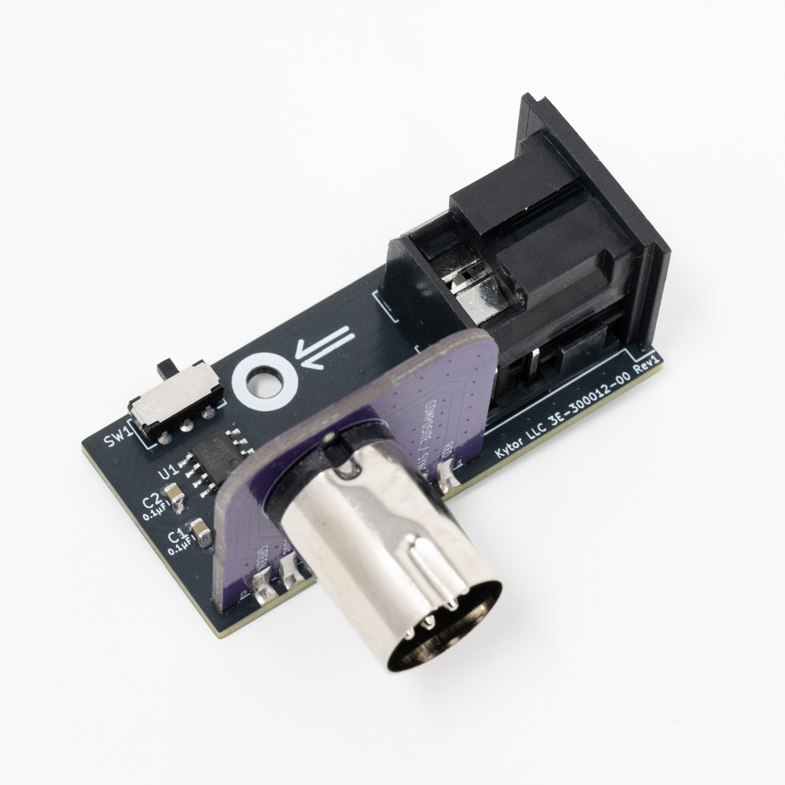

# Turbo Duo DIN 8 90 Degree
The PC Engine Duo / Turbo Duo DIN 8 AV port protrudes out the side, an inconvenience in some setups. This two piece PCB assembly is designed to rotate the DIN 8 connector 90 degrees to face towards the rear. The two pieces consist of the upper (3E-300011) and base (3E-300012).

The Turbo Duo uses a full-size DIN 5 connector, which if modded for RGB video one typically chooses a DIN 8 270 connector for consistency with the Duo R and readily available AV cables. Unfortunately PCB 180 mount DIN 8 270 male connectors are unavailable at this time, so this board is designed to accept both DIN 8 262 and 270 male connectors.

The only possibility at the time of this writing is to use DIN 8 262 male connectors which are technically incompatible with DIN 8 270 female, although if you bend the pins you can force it to work (functional, but not recommended). Therefore if using this device I would recommend replacing the PCB 90 mount DIN 8 270 female connector on your Turbo Tuo with a DIN 8 262 female connector.

The lower board includes an optional sync stripper for CSYNC output.

A provision is provided for mounting to a plastic enclosure shell. A shell has not been designed as part of this project.

## Files Included
- **PCB Design Files** (KiCAD, Gerber)
- **Bill of Materials** (XLSX)
- **CAD** (STEP)
- **Photos**

## Assembly
1. Solder all components in place. Alternatively, if a sync stripper is not desired do not populate C1-2, SW1 or U1 and solder jumper JP1.
2. Solder upper board to lower board.

## PCB Revision History
- Rev 1 - Initial release
- Rev 0 - Development (unreleased)

## License
This project is open-source under the [CC BY 4.0 (Attribution 4.0 International)](https://creativecommons.org/licenses/by/4.0/).

## Disclaimer
This project is provided "as-is" without any warranty, express or implied, including but not limited to warranties of merchantability or fitness for a particular purpose. No support is provided.

Amazon links are affiliates.